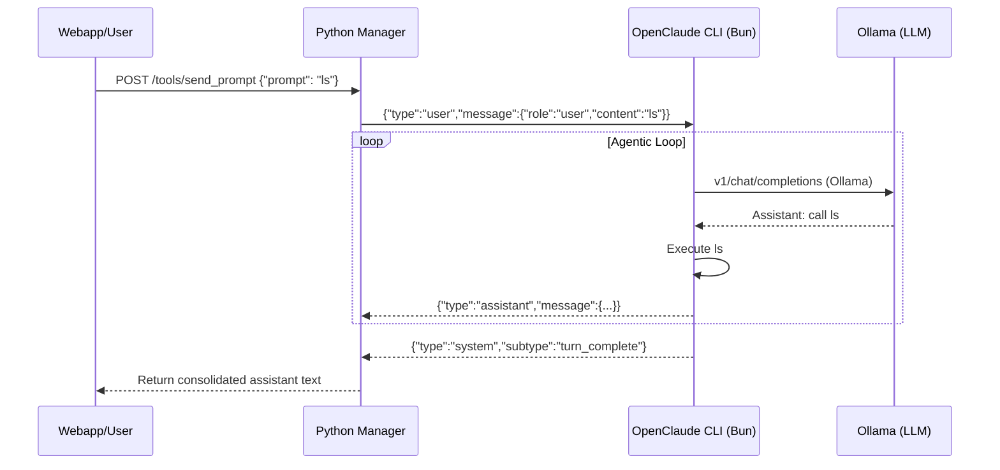
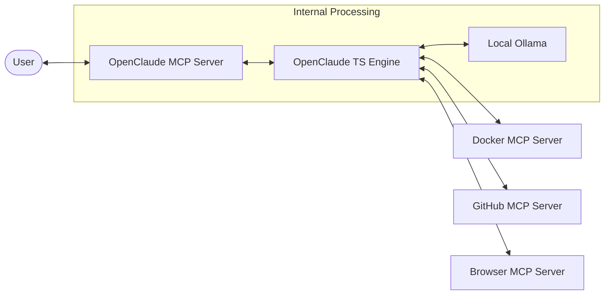

# OpenClaude MCP: Master Architecture

Welcome to the **OpenClaude MCP** control plane. This document provides a high-level overview of how the system orchestrates local agentic workflows using the Claude Code engine.

## 1. Conceptual Model

OpenClaude MCP operates as a **Hybrid Bridge** between a high-fidelity TypeScript agent (engine) and a multi-session Python manager (control plane).

### The Two Halves:
1.  **The Engine (TypeScript)**: A specialized fork of Claude Code optimized for local inference. It handles tool use, reasoning, and context window management.
2.  **The Manager (Python)**: Acts as the session orchestrator. It manages process lifecycles, provides an SSE/REST bridge for the web UI, and runs the **KAIROS** background daemon.

---

## 2. Synchronization: The NDJSON Stream (v2)

OpenClaude CLI implements a two-way JSON stream for reliable SDK-style interaction. This prevents the "partial capture" and "EOT collision" bugs common in raw terminal scraping.

1.  **Request**: Python writes a `SDKUserMessage` as a single NDJSON line to CLI `stdin`.
2.  **Streaming**: CLI writes `SDKAssistantMessage` chunks to `stdout`.
3.  **Completion**: CLI writes a `system/turn_complete` message to signal the end of the agent's turn.
4.  **Capture**: Python blocks the `send()` call until the completion message is parsed, ensuring a synchronous developer experience.

---

## 3. KAIROS (autoDream)

- [06 SECURITY ADVISORY (Axios)](06_SECURITY_ADVISORY_AXIOS.md)
- [07 MJS STANDARD](07_MJS_STANDARD.md)
- [ARCHITECTURE](architecture.md)

**KAIROS** is a proactive memory daemon that runs as an `asyncio` loop in the Python host.

- **Proactive Consolidation**: It monitors session idle time.
- **Context Synthesis**: When a session is idle, KAIROS triggers a "Dream" phase where it summarizes recent interactions and updates the project's `MEMORY.md`.
- **Zero-Friction**: This happens in the background, ensuring the agent always has an up-to-date long-term memory of the project without manual intervention.

---

## 4. MCP Mesh Architecture

OpenClaude is not just an MCP server; it is also an **MCP Client**.

When you run a command like "Analyze the docker environment," the OpenClaude engine can dynamically discover and call tools from *other* MCP servers registered in the environment (e.g., `docker-mcp`, `github-mcp`), creating a recursive mesh of capabilities.

---

## 5. Safety Guardrails

Safety is baked into the system at the prompt level:
- **Confirmation Hooks**: Risky tools (like `rm` or `git push --force`) require explicit confirmation.
- **Cyber-Risk Filters**: The system is instructed to avoid URL guessing and insecure credential handling.
- **Read-Only Discovery**: Where possible, the agent is pushed towards read-only tools for initial analysis.

For more details on the prompt logic, see [PROMPT_SYSTEM.md](PROMPT_SYSTEM.md).
## 6. Observability: Unified High-Fidelity Logging

The system features a centralized **Global Log Buffer** and a dedicated **Logger Page** in the webapp for real-time diagnostics.

1.  **Unified Logger**: Implemented in `openclaude/logging_util.py`, this engine consolidates all application-level logic from the **Session Manager** and **KAIROS** daemon into a single stream.
2.  **High-Fidelity Tracing**: Unlike standard web server logs, OpenClaude captures and presents actual state machine transitions, including:
    -   Session provisioning and process lifecycles.
    -   NDJSON prompt delivery and turn completion events.
    -   KAIROS "Dream" cycles and memory consolidation successes/failures.
3.  **Noise Filtering**: The logger automatically suppresses redundant health checks and Ollama polling, ensuring the "Logs" tab remains focused on actionable developer information.
4.  **Health Verification**: `start.ps1` performs an automated health check against `127.0.0.1:10932/api/health` before allowing the web UI to bind, preventing "proxy error 504" loops.
5.  **Real-time Feed**: The `/api/logs/system` endpoint serves a rolling window of the latest 200 logs to the webapp for instant debugging.
