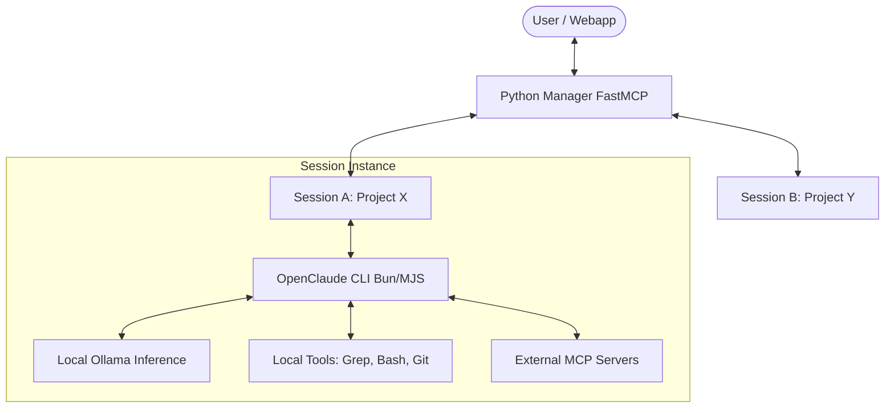
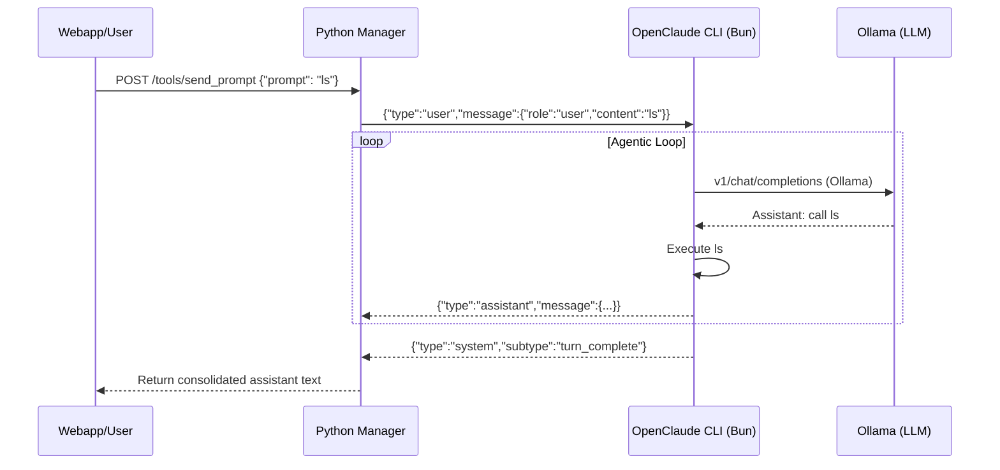

# OpenClaude MCP: Master Architecture

Welcome to the **OpenClaude MCP** control plane. This document provides a high-level overview of how the system orchestrates local agentic workflows using the Claude Code engine.

## 1. Conceptual Model

OpenClaude MCP operates as a **Hybrid Bridge** between a high-fidelity TypeScript agent (engine) and a multi-session Python manager (control plane).



### The Two Halves:
1. **The Engine (TypeScript)**: A specialized fork of Claude Code optimized for local inference. It handles tool use, reasoning, and context window management.
2. **The Manager (Python)**: Acts as the session orchestrator. It manages process lifecycles, provides an SSE/REST bridge + SSE push for the web UI, runs the **KAIROS** background daemon, and persists session state to disk.

---

## 2. Transport Layer

### Dual Transport (port 10932)
- **SSE Transport** (`/sse`): For MCP clients (Claude Desktop, Cursor)
- **REST Bridge** (`/tools/{name}`): JSON POST for webapp/curl
- **SSE Push** (`/api/events`): Real-time event stream for the webapp — no polling
- **Health** (`/api/health`): Ollama connectivity + active sessions
- **Capabilities** (`/api/capabilities`): Feature discovery

The `TOOL_REGISTRY` dict maps tool names to the same async functions used by FastMCP. All 14 tools are callable from both transports.

### Auth
Optional `Authorization: Bearer <token>` middleware via `OPENCLAUDE_MCP_TOKEN`. SSE transport exempted for MCP clients.

---

## 3. Synchronization: The NDJSON Stream (v3)

OpenClaude CLI implements a two-way JSON stream for reliable SDK-style interaction.

1. **Request**: Python writes a `SDKUserMessage` as a single NDJSON line to CLI `stdin`.
2. **Streaming**: CLI writes `SDKAssistantMessage` chunks to `stdout`.
3. **Completion**: CLI writes a `system/turn_complete` message to signal end of turn.
4. **Capture**: Python blocks the `send()` call until the completion message is parsed via `asyncio.Event`.



Protocol history:
- **v1 (EOT sentinel)**: BROKEN — openclaude `JSON.parse()` crashes on raw sentinel
- **v2 (NDJSON without stream-json)**: BROKEN — prompt read from argv, not stdin
- **v3 (NDJSON + all flags)**: Correct — `--print --input-format=stream-json --output-format=stream-json --verbose`

---

## 4. KAIROS (autoDream)

KAIROS (Ancient Greek: "the right moment") is a proactive memory daemon from the Claude Code leak. It runs as an `asyncio` loop in the Python host.

### The four-phase cycle (triggers when session is idle)

1. **Orient** — reads `MEMORY.md` from the working directory (under `FileLock`)
2. **Gather** — collects recent session output as observations
3. **Consolidate** — calls local Ollama model to merge, deduplicate, harden facts
4. **Prune** — rewrites `MEMORY.md` (under `FileLock`)

### Key features
- **FileLock**: MEMORY.md reads/writes are serialised via a sidecar `.lock` file
- **Abort-on-activity**: If the user sends a prompt during a long consolidation call, the write is aborted — no stale overwrites
- **Configurable poll interval**: `KAIROS_POLL_SECONDS` env var (default 30)
- **Consolidation budget**: `KAIROS_MAX_CONSOLIDATIONS` env var (default 100) — loop exits when reached
- **Logging**: All events go to the centralized log buffer, accessible via `/api/logs/system` and the webapp Logger page
- **State Persistence**: Consolidation count and thresholds saved to `~/.config/openclaude/kairos_state.json` on every enable/disable/consolidation. Restored on startup via `KairosController.load_persisted_state()`. Survives server restarts.

---

## 5. Session Management

### Lifecycle
1. `start_session` → provisioning (npm install, build) → subprocess launch → running
2. `send_prompt` → NDJSON write → `asyncio.Event` wait (180s timeout) → response
3. `stop_session` → EOF on stdin → SIGTERM (5s) → SIGKILL (5s) → cleanup

### Persistence
Session metadata is saved to `~/.config/openclaude/sessions.json` on shutdown. On startup, stale PIDs are detected and cleaned up. Survives server restarts.

### Usage Analytics
Each session tracks `total_prompts`, `total_output_chars`, and `estimated_input_tokens` (chars/4 approximation). These are returned in `send()` as `turn_duration_seconds` and visible in `snapshot().usage`. Persisted alongside session metadata for historical tracking.

### Multimodal Input
The `send_multimodal` tool accepts `text` + a list of `image_paths`. Supported formats: png, jpeg, webp, gif. Images are read from disk, base64-encoded, and embedded as native Claude Code SDK content blocks:

```json
{"type": "image", "source": {"type": "base64", "media_type": "image/png", "data": "<base64>"}}
```

Works with any vision-capable Ollama model (llava, qwen-vl, bakllava, etc.). The tool is registered in both FastMCP and REST bridge. Total tools: 15.

### Environment Security
Whitelist-based env var filtering: only `PATH`, `HOME`, `USERPROFILE`, etc. + `OPENCLAUDE_*`, `ANTHROPIC_*`, `OLLAMA_*` prefixes. Uses `asyncio.create_subprocess_exec` (no shell injection).

---

## 6. Safety Guardrails

Safety is baked in at the prompt level:

- **Content Filters**: Kid-safe mode injects a 10-rule policy (sex ed, violence, self-harm, medical)
- **Proactive Privacy**: Every 5-10 turns, a friendly reminder about online safety
- **Caregiver Alerts**: `caregiver_alert` tool logs to `%TEMP%/openclaude_caregiver_alerts.log` and optionally POSTs to `CAREGIVER_WEBHOOK_URL`
- **Cyber-Risk Filters**: The system avoids URL guessing and insecure credential handling

---

## 7. Observability

### Centralized Logging
- `WebLogHandler` (200-line rolling buffer) attached to `openclaude`, `uvicorn`, `uvicorn.error`, `uvicorn.access`
- Noise filtering: suppresses `/api/health` and `/api/tags` polling
- REST endpoint: `GET /api/logs/system`
- SSE push: `GET /api/events` streams `sessions` and `logs` events

### Webapp Pages (9 total)
| Page | Description |
|:---|:---|
| **Dashboard** | Stat cards, Ollama status, default model, quick actions |
| **Sessions** | New session form, session list with split-view chat + xterm.js |
| **Models** | Model cards with VRAM/speed/context/license metadata |
| **KAIROS** | Per-session toggle + real-time consolidation log viewer |
| **Examples** | Interactive API playground with live "Run" buttons |
| **Logs** | Real-time unified system log stream with auto-scroll |
| **Help** | Searchable API reference — tool params, return schemas, env vars, error codes |
| **Settings** | Launch paths, endpoint URLs, Claude Desktop config snippet |

---

## 8. SSE Push (Real-time Updates)

The webapp no longer polls every 8s. Instead:

1. Backend: `GET /api/events` is a long-lived SSE endpoint
2. `_notify_sessions()` is called on every `start_session` / `stop_session` — broadcasts session state to all subscribers via `asyncio.Queue`
3. `_notify_logs()` pushes log updates
4. Webapp `EventSource` subscribes on mount, dispatches to `setSessions()` / `setSystemLogs()` store actions

---

## 9. Deployment

### Native
```powershell
.\start.ps1
```
Health-gating: waits up to 30s for `/api/health` to respond. Port clearing: kills stale processes on 10932.

### Docker
```yaml
docker compose up
```
Three services: `ollama` (GPU-enabled), `mcp` (Python backend), `webapp` (nginx static). Nginx proxies `/tools/` and `/api/` to backend.

### CI/CD
`.github/workflows/ci.yml` — ruff + pytest on push/PR. E2e tests use `respx` to mock Anthropic API.

---

## 10. Configuration Reference

| Env Var | Default | Description |
|:---|:---|:---|
| `OPENCLAUDE_MCP_PORT` | `10932` | Backend port |
| `OPENCLAUDE_MCP_TOKEN` | — | REST auth middleware (disabled if unset) |
| `OPENCLAUDE_DIR` | `D:\Dev\repos\external\openclaude` | Path to openclaude source |
| `OPENCLAUDE_DEFAULT_WORKING_DIR` | `D:\Dev\repos\claude-code-1` | Default session working dir |
| `OPENCLAUDE_ULTRAPLAN_MODEL` | `claude-sonnet-4-6` | Anthropic model for ULTRAPLAN |
| `OPENCLAUDE_CONFIG_DIR` | `~/.config/openclaude` | Persistence directory |
| `KAIROS_POLL_SECONDS` | `30` | KAIROS daemon poll interval |
| `KAIROS_MAX_CONSOLIDATIONS` | `100` | Max consolidations per session |
| `CAREGIVER_WEBHOOK_URL` | — | Webhook for caregiver alerts |
| `ANTHROPIC_API_KEY` | — | Required for ULTRAPLAN |
